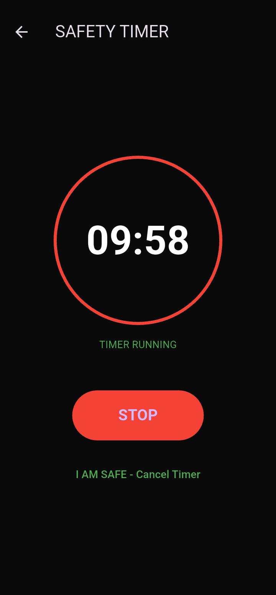

# 🔐 REPSHIELD
### Personal Safety Application — Flutter

> Built for women and vulnerable individuals who need safety tools that work in real emergencies — not just on paper.

---

## 🎯 The Problem

In India, 1 woman is assaulted every 15 minutes. Most safety apps require unlocking the phone, opening the app, and pressing a button. In a real emergency — that's 3 steps too many.

REPSHIELD reduces that to **one shake.**

---

## 📱 Demo

| Home Screen | SOS Active | Trusted Contacts |
|-------------|------------|-----------------|
|  |  |  |

---

## 🚀 Features

| Feature | Description | Technology |
|---------|-------------|------------|
| 🔴 Shake-to-SOS | Shake phone → GPS location sent via SMS | sensors_plus, Geolocator |
| 📍 Live GPS SOS | Real-time coordinates in Google Maps link | Geolocator |
| 👥 Trusted Contacts | Add multiple contacts — all receive SOS | shared_preferences |
| 👁️ Stealth Mode | App becomes blank screen instantly | SystemChrome |
| 📓 Incident Journal | Log incidents with SHA-256 evidence sealing | crypto |
| ⏱️ Safety Timer | Auto-trigger if user doesn't check in | Timer |
| 🔐 Evidence Locker | Secure vault for sensitive files | Local storage |

---

## 🛠 Tech Stack

\\\
Frontend:     Flutter (Dart)
Location:     Geolocator package
Sensors:      sensors_plus (accelerometer)
Storage:      shared_preferences
SMS:          url_launcher
Platform:     Android (tested on real device)
\\\

---

## 📲 Installation

\\\ash
git clone https://github.com/priya-codesdaily/REPSHIELD.git
cd REPSHIELD
flutter pub get
flutter run
\\\

Or download the APK directly:
👉 [Download REPSHIELD v1.0.0](https://github.com/priya-codesdaily/REPSHIELD/releases/tag/v1.0.0)

---

## 🔥 How Shake-to-SOS Works

\\\dart
// Accelerometer detects shake magnitude
accelerometerEventStream().listen((event) {
  double magnitude = sqrt(
    event.x² + event.y² + event.z²
  );
  if (magnitude > 20) {
    // Fetch GPS → Build Maps URL → Send SMS
    sendSOS();
  }
});
\\\

---

## 🏗️ Architecture

\\\
lib/
├── main.dart                    # App entry + Dashboard
└── screens/
    ├── evidence_locker.dart     # Secure vault
    ├── incident_journal.dart    # Evidence logging
    ├── safety_timer.dart        # Auto-trigger timer
    └── trusted_contacts.dart   # Contact manager
\\\

---

## 🔮 Roadmap (v2)

- [ ] Voice safe word trigger ("Lotus" → silent SOS)
- [ ] PIN / biometric vault lock
- [ ] Fake incoming call screen
- [ ] Auto SMS without user interaction
- [ ] Firebase cloud backup
- [ ] Sign language support for deaf users

---

## 📊 Impact

\\\
Target users:     Women + vulnerable individuals
SOS trigger:      1 shake (no unlock needed)
Location method:  Real-time GPS coordinates
Data privacy:     All data stays on device
\\\

---

## 👩‍💻 Developer

**Anshu Priya** — Self-taught Flutter Developer | BCA Student | Age 20

> "I built REPSHIELD because safety should not require 3 steps. One shake should be enough."

---

> 💡 *Every feature in REPSHIELD exists because a real person needed it.*
