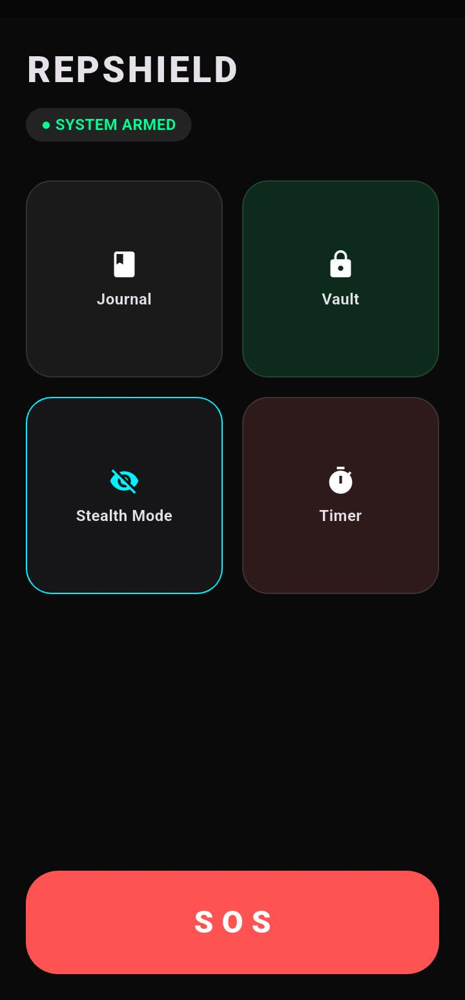
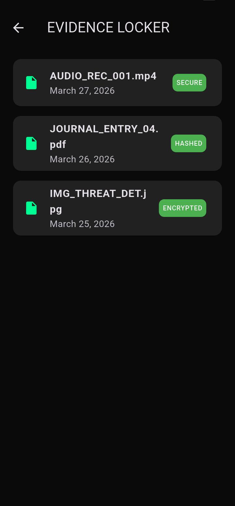
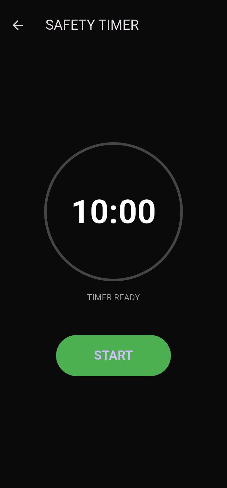

# 🔐 REPSHIELD
### Personal Safety App — Built with Flutter

> A real-time personal safety application designed to protect users in emergency situations through quick alerts, secure evidence storage, and stealth operation.

---

## 📱 Screenshots

| Dashboard | Evidence Vault | Safety Timer |
|-----------|---------------|--------------|
|  |  |  |

---

## 🚀 Features

| Feature | Description |
|--------|-------------|
| 🔴 SOS Alert | Long press to send GPS location via SMS instantly |
| 📓 Incident Journal | Log and seal incidents with hash-based evidence |
| 🔐 Evidence Locker | Secure storage for files and sensitive media |
| 👁 Stealth Mode | Hides app as blank screen, exit with long press |
| ⏱ Safety Timer | Auto-triggers alert if user doesn't check in |

---

## 🛠 Tech Stack

- **Framework:** Flutter (Dart)
- **Location:** Geolocator package
- **Communication:** URL Launcher (SMS)
- **UI:** Custom dark theme with Material Design
- **Build:** Android (Gradle + NDK)

---

## 📲 Installation

\\\ash
git clone https://github.com/priya-codesdaily/REAPSHIELD.git
cd REAPSHIELD
flutter pub get
flutter run
\\\

---

## 🔥 How SOS Works

1. User long-presses the SOS button
2. App fetches real-time GPS coordinates
3. Builds a Google Maps link with exact location
4. Opens SMS app with pre-filled emergency message
5. Falls back to locationless SOS if GPS unavailable

---

## 🧠 Architecture

\\\
lib/
├── main.dart              # App entry + Dashboard
└── screens/
    ├── evidence_locker.dart   # Vault screen
    ├── incident_journal.dart  # Journal screen
    └── safety_timer.dart      # Timer screen
\\\

---

## 🔮 Upcoming Features (v2)

- [ ] Trusted contacts manager (multi-contact SOS)
- [ ] Shake-to-SOS trigger
- [ ] PIN / biometric vault lock
- [ ] Fake incoming call screen
- [ ] Cloud backup via Firebase
- [ ] Auto SMS without user interaction

---

## 👩‍💻 Developer

**Priya** — BCA Student | Flutter Developer

---

> 💡 *REPSHIELD was built to solve a real problem. Every feature exists for a reason.*
